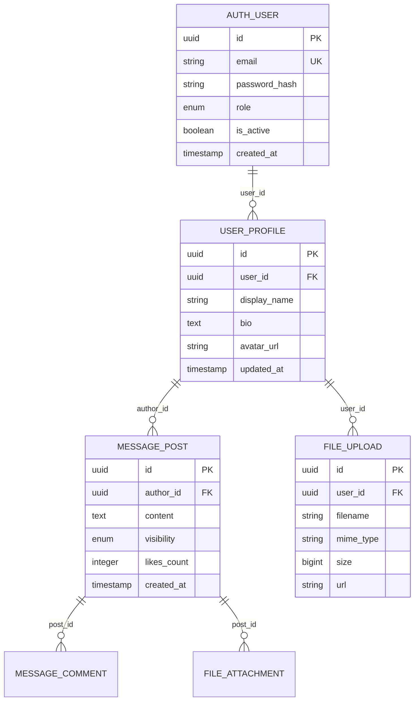

# Schémas de Base de Données

## 🎯 Vue d'ensemble

Cette section détaille les schémas de base de données pour chaque microservice de l'architecture Groupomania. Chaque service possède sa propre base de données PostgreSQL pour garantir l'isolation et l'autonomie.

## 🗄️ Bases de Données par Service

### 1. groupomania_auth (Auth Service)
- **Port:** 5432
- **Service:** Auth Service (3001)
- **Responsabilité:** Authentification et gestion des tokens

### 2. groupomania_users (User Service)  
- **Port:** 5432
- **Service:** User Service (3002)
- **Responsabilité:** Profils utilisateurs et relations sociales

### 3. groupomania_messages (Message Service)
- **Port:** 5432
- **Service:** Message Service (3003)
- **Responsabilité:** Posts, commentaires, timeline

### 4. groupomania_files (File Service)
- **Port:** 5432
- **Service:** File Service (3004)
- **Responsabilité:** Gestion des fichiers et métadonnées

## 📊 Relations Inter-Services



## 🔗 Contraintes de Cohérence

### Clés Étrangères Logiques
Bien que chaque service ait sa propre base de données, les relations logiques sont maintenues via :

1. **user_id** - Référence commune à travers tous les services
2. **Événements** - Communication asynchrone pour maintenir la cohérence
3. **API Calls** - Vérification synchrone lors d'opérations critiques

### Patterns de Cohérence
- **Saga Pattern** pour les transactions distribuées
- **Event Sourcing** pour l'audit et la réconciliation
- **Eventual Consistency** pour les données non-critiques

## 📚 Documentation Détaillée

Consultez les schémas détaillés par service :

- [Auth Service Schema](./auth-service-schema.md)
- [User Service Schema](./user-service-schema.md) 
- [Message Service Schema](./message-service-schema.md)
- [File Service Schema](./file-service-schema.md)

## 🛠️ Scripts de Migration

### Initialisation Complète
```bash
# Depuis la racine du projet
docker-compose -f docker-compose.microservices.yml up postgres
./scripts/init-db.sh
```

### Par Service
```bash
# Auth Service
cd microservices/auth-service
npm run db:migrate

# User Service  
cd microservices/user-service
npm run db:migrate

# Message Service
cd microservices/message-service
npm run db:migrate

# File Service
cd microservices/file-service
npm run db:migrate
```

## 🔍 Outils de Monitoring

### PgAdmin
- **URL:** http://localhost:5050
- **Email:** admin@groupomania.com
- **Password:** admin

### Requêtes de Monitoring
```sql
-- Taille des bases de données
SELECT 
    datname,
    pg_size_pretty(pg_database_size(datname)) as size
FROM pg_database 
WHERE datname LIKE 'groupomania_%';

-- Connexions actives par base
SELECT 
    datname,
    count(*) as connections
FROM pg_stat_activity 
WHERE datname LIKE 'groupomania_%'
GROUP BY datname;
```

## 🚀 Backup et Restore

### Backup Automatique
```bash
# Script de backup quotidien
./scripts/backup.sh all

# Backup par service
./scripts/backup.sh auth-service
./scripts/backup.sh user-service
./scripts/backup.sh message-service
./scripts/backup.sh file-service
```

### Restore
```bash
# Restore complet
./scripts/restore.sh backup_2025-07-25.sql

# Restore par service  
./scripts/restore.sh auth-service backup_auth_2025-07-25.sql
```
