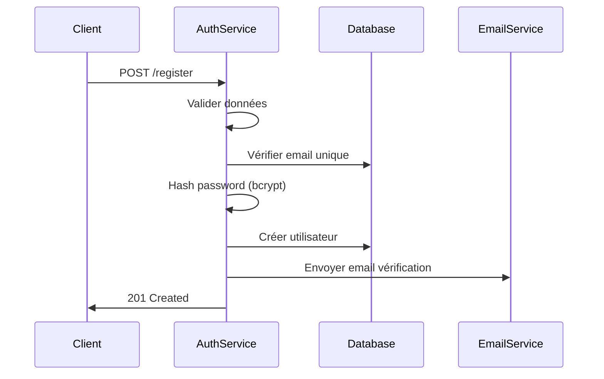
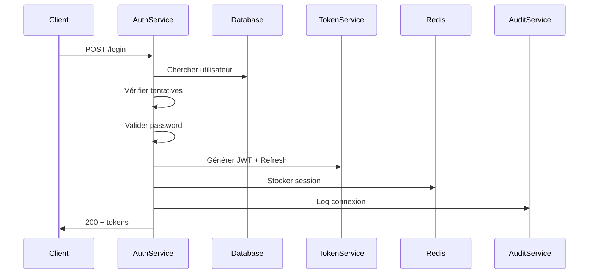
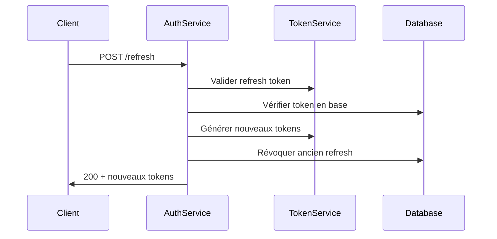

# Auth Service

## 🎯 Vue d'ensemble

Le service d'authentification gère toute la sécurité et l'authentification des utilisateurs dans l'architecture Groupomania. Il fournit une authentification robuste basée sur JWT avec des fonctionnalités de sécurité avancées.

## 🏗️ Architecture

```
┌─────────────────────────────────────────────────────────────┐
│                AUTH SERVICE (Port 3001)                    │
├─────────────────────────────────────────────────────────────┤
│  ┌─────────────┐  ┌─────────────┐  ┌─────────────┐        │
│  │Registration │  │   Login     │  │   Token     │        │
│  │ & Validation│  │   & Audit   │  │ Management  │        │
│  └─────────────┘  └─────────────┘  └─────────────┘        │
├─────────────────────────────────────────────────────────────┤
│  ┌─────────────┐  ┌─────────────┐  ┌─────────────┐        │
│  │   Brute     │  │  Password   │  │   Role      │        │
│  │ Force       │  │  Security   │  │ Management  │        │
│  │ Protection  │  │   (bcrypt)  │  │             │        │
│  └─────────────┘  └─────────────┘  └─────────────┘        │
└─────────────────────────────────────────────────────────────┘
           │                        │
    ┌──────▼──────┐         ┌──────▼──────┐
    │ PostgreSQL  │         │    Redis    │
    │groupomania_ │         │   Cache     │
    │    auth     │         │  Sessions   │
    └─────────────┘         └─────────────┘
```

## 🚀 Fonctionnalités

### 🔐 Authentification
- **Inscription:** Validation complète et création de compte
- **Connexion:** Authentification sécurisée avec audit
- **JWT Tokens:** Access token (15 min) + Refresh token (7 jours)
- **Déconnexion:** Invalidation des tokens
- **Token Refresh:** Renouvellement automatique des tokens

### 🛡️ Sécurité Avancée
- **Hashage bcrypt:** Protection des mots de passe avec salt
- **Protection Brute Force:** Limitation des tentatives de connexion
- **Verrouillage de Compte:** Blocage automatique après échecs
- **Audit Trail:** Traçage de toutes les actions d'authentification
- **Rate Limiting:** Protection contre les attaques automatisées

### 👥 Gestion des Utilisateurs
- **Rôles:** employee, admin, moderator
- **Permissions:** Contrôle d'accès granulaire
- **Validation Email:** Vérification des adresses email
- **Politiques de Mot de Passe:** Règles de complexité

## 🗂️ Structure du Projet

```
microservices/auth-service/
├── src/
│   ├── config/
│   │   ├── config.ts           # Configuration générale
│   │   ├── database.ts         # Configuration PostgreSQL
│   │   └── redis.ts            # Configuration Redis
│   ├── controllers/
│   │   ├── authController.ts   # Logique d'authentification
│   │   └── userController.ts   # Gestion utilisateurs auth
│   ├── middleware/
│   │   ├── auth.ts             # Middleware JWT
│   │   ├── validation.ts       # Validation des données
│   │   ├── rateLimiter.ts      # Rate limiting
│   │   └── bruteForce.ts       # Protection brute force
│   ├── models/
│   │   ├── User.ts             # Modèle utilisateur
│   │   ├── LoginAttempt.ts     # Tentatives de connexion
│   │   └── RefreshToken.ts     # Tokens de rafraîchissement
│   ├── routes/
│   │   └── auth.ts             # Routes d'authentification
│   ├── services/
│   │   ├── authService.ts      # Logique métier auth
│   │   ├── tokenService.ts     # Gestion des tokens
│   │   ├── emailService.ts     # Envoi d'emails
│   │   └── auditService.ts     # Audit et logging
│   ├── utils/
│   │   ├── validation.ts       # Schémas de validation
│   │   ├── security.ts         # Utilitaires sécurité
│   │   └── logger.ts           # Configuration logs
│   ├── app.ts                  # Configuration Express
│   └── server.ts               # Point d'entrée
├── package.json
├── tsconfig.json
├── Dockerfile
└── README.md
```

## 🛣️ Endpoints API

### Publics (Sans authentification)
```typescript
POST   /register           # Inscription
POST   /login             # Connexion
POST   /refresh           # Renouvellement token
POST   /logout            # Déconnexion
POST   /forgot-password   # Mot de passe oublié
POST   /reset-password    # Réinitialisation MDP
GET    /verify-email      # Vérification email
```

### Protégés (Authentification requise)
```typescript
GET    /profile           # Profil utilisateur auth
PUT    /profile           # Mise à jour profil
POST   /change-password   # Changement MDP
GET    /sessions          # Sessions actives
DELETE /sessions/:id      # Supprimer session
```

### Administrateur
```typescript
GET    /admin/users       # Liste utilisateurs
PUT    /admin/users/:id   # Modifier utilisateur
DELETE /admin/users/:id   # Supprimer utilisateur
GET    /admin/audit       # Logs d'audit
```

## 📊 Modèles de Données

### User
```typescript
interface User {
  id: string;
  email: string;
  password: string;        // bcrypt hash
  firstName: string;
  lastName: string;
  role: 'employee' | 'admin' | 'moderator';
  isActive: boolean;
  isEmailVerified: boolean;
  lastLogin: Date;
  loginAttempts: number;
  lockUntil: Date;
  createdAt: Date;
  updatedAt: Date;
}
```

### LoginAttempt
```typescript
interface LoginAttempt {
  id: string;
  userId: string;
  email: string;
  ipAddress: string;
  userAgent: string;
  success: boolean;
  reason: string;
  timestamp: Date;
}
```

### RefreshToken
```typescript
interface RefreshToken {
  id: string;
  userId: string;
  token: string;           // Hash du token
  expiresAt: Date;
  isRevoked: boolean;
  ipAddress: string;
  userAgent: string;
  createdAt: Date;
}
```

## ⚙️ Configuration

### Variables d'Environnement
```env
# Server
PORT=3001
NODE_ENV=development

# Database
DB_HOST=postgres
DB_PORT=5432
DB_NAME=groupomania_auth
DB_USERNAME=groupomania_user
DB_PASSWORD=groupomania_password

# Redis
REDIS_HOST=redis
REDIS_PORT=6379

# JWT
JWT_SECRET=your-super-secret-jwt-key
JWT_EXPIRES_IN=15m
JWT_REFRESH_SECRET=your-refresh-secret
JWT_REFRESH_EXPIRES_IN=7d

# Security
BCRYPT_ROUNDS=12
MAX_LOGIN_ATTEMPTS=5
LOCK_TIME=30 # minutes

# Email (optionnel)
SMTP_HOST=smtp.example.com
SMTP_PORT=587
SMTP_USER=noreply@groupomania.com
SMTP_PASS=smtp_password
```

### Politique de Sécurité
```typescript
const securityPolicy = {
  password: {
    minLength: 8,
    requireUppercase: true,
    requireLowercase: true,
    requireNumbers: true,
    requireSpecialChars: true
  },
  bruteForce: {
    maxAttempts: 5,
    lockTimeMinutes: 30,
    resetTimeMinutes: 60
  },
  tokens: {
    accessTokenTTL: '15m',
    refreshTokenTTL: '7d',
    rotateRefreshTokens: true
  }
};
```

## 🔐 Flux d'Authentification

### Inscription


### Connexion


### Token Refresh


## 🛡️ Sécurité Implémentée

### Protection Brute Force
```typescript
class BruteForceProtection {
  async checkAttempts(email: string, ip: string): Promise<boolean> {
    const attempts = await this.getRecentAttempts(email, ip);
    return attempts < MAX_ATTEMPTS;
  }

  async recordAttempt(email: string, ip: string, success: boolean) {
    await LoginAttempt.create({
      email, ipAddress: ip, success, timestamp: new Date()
    });
    
    if (!success) {
      await this.incrementFailedAttempts(email);
    }
  }
}
```

### Validation JWT
```typescript
const validateToken = (token: string): Promise<JWTPayload> => {
  return new Promise((resolve, reject) => {
    jwt.verify(token, JWT_SECRET, (err, decoded) => {
      if (err) reject(new UnauthorizedError('Invalid token'));
      resolve(decoded as JWTPayload);
    });
  });
};
```

## 📊 Audit et Monitoring

### Logs d'Audit
```json
{
  "timestamp": "2025-07-25T10:30:00Z",
  "event": "login_success",
  "userId": "user-123",
  "email": "user@example.com",
  "ipAddress": "192.168.1.100",
  "userAgent": "Mozilla/5.0...",
  "details": {
    "loginMethod": "password",
    "sessionId": "session-456"
  }
}
```

### Métriques Collectées
- Nombre de connexions/inscriptions
- Taux d'échec des authentifications
- Tentatives de brute force détectées
- Performance des endpoints
- Utilisation des tokens

## 🚀 Démarrage

### Développement Local
```bash
cd microservices/auth-service
npm install
npm run dev
```

### Base de Données
```bash
# Initialisation PostgreSQL
psql -U postgres
CREATE DATABASE groupomania_auth;
CREATE USER groupomania_user WITH PASSWORD 'password';
GRANT ALL ON DATABASE groupomania_auth TO groupomania_user;
```

### Docker
```bash
docker build -t groupomania-auth-service .
docker run -p 3001:3001 --env-file .env groupomania-auth-service
```

## 🧪 Tests

### Tests Unitaires
```bash
npm test                    # Tous les tests
npm run test:unit          # Tests unitaires
npm run test:integration   # Tests d'intégration
npm run test:security      # Tests de sécurité
```

### Tests de Sécurité
- Validation des mots de passe
- Protection brute force
- Validation des tokens
- Injection SQL prevention
- XSS protection

## 🔮 Évolutions Futures

- [ ] Multi-factor authentication (2FA)
- [ ] OAuth2/OIDC integration
- [ ] Biometric authentication
- [ ] Social login (Google, GitHub)
- [ ] Advanced fraud detection
- [ ] Passwordless authentication
